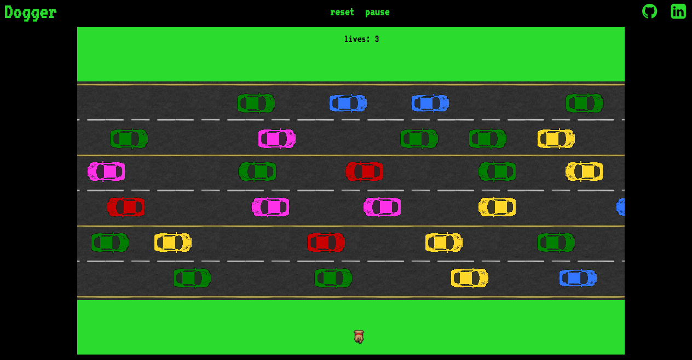

# PhotOn

[Dogger live][dogger]

[dogger]: https://qadirm.github.io/Dogger

## About the Game

Dogger is a play on the classic game Frogger.  The game is a one-player game that plays out on a square grid. The goal of the game is to move the dog across multiple lanes of traffic and reach the other side of the road safely avoiding getting hit by a vehicle.
This game is built using JavaScript, HTML5 Canvas, and `keymaster`.



## Instructions

The rules of the game are as follows:

1) The dog can be moved using the arrow keys.
2) The player has 3 lives (attempts) to safely cross the road and win the game.
3) Anytime the dog is hit by the moving traffic, the player starts over with the dog positioned back on the initial side
4) The Game is over when the player clears the level or runs out of lives.

The 'pause' button pauses the game.

The 'reset' button clears the canvas and creates a new one.

## About the Code

This game is written in ECMAScript 6 (ES6) format. Babel was used to translate the code to ES5, and Webpack to bundle and serve up the various scripts. keymaster.js was used to connect the users keystrokes to the gameplay.

### Class Breakdown

- `game.js`
- `vehicle.js`
- `dog.js`

#### `game.js`

Holds a collection of the vehicles and dog. It handles the logic for creating and updating the vehicles and rendering them on the canvas. It also handles the collision logic.

```js
checkCollision(vehicle) {
  return(
  this.dog.pos.x < vehicle.pos.x + vehicle.dim.w &&
  vehicle.pos.x < this.dog.pos.x + this.dog.dim.w &&
  this.dog.pos.y < vehicle.pos.y + vehicle.dim.h &&
  vehicle.pos.y < this.dog.pos.y + this.dog.dim.h
  );
}
```

The framerate is set at 30 frames per second using setInterval

```js
play() {
  this.setup();
  this.dog.move();
  this.myVar = window.setInterval(() => {
    this.ctx.clearRect(0, 0, 1000, 600);
    ...
    ...
  }, 33);
}
```

The user is able to reset the game by hitting the reset button

```js
const reset = document.getElementById("reset-button");
reset.addEventListener("click", () => {
  clearInterval(this.myVar);
  this.play();
});
```

#### `vehicle.js`

It handles the logic for creating, moving, and drawing the vehicles.
Once a vehicle exits the canvas display area, it wraps around and reappears.

```js
if (this.direction === "east") {
  if (this.pos.x > 1070) {
   this.pos.x = -50;
  } else {
   this.pos.x += this.speed;
  }
}
```

#### `dog.js`

It handles the logic for creating the dog and responding to user interaction.

The dog movement is animated using three different frames and looping through them on each move.

```js
this.dog.src = `assets/images/dog-up-${this.index}.png`;
```

Keymaster was deployed to add event listeners on the arrow keys triggering the movement of the dog

```js
key('up', () => {
  this.pos.y -= 30;
  if(this.outOfBounds() || this.game.gamePaused || this.game.won || this.game.lost) {
    this.pos.y += 30;
  }else {
    this.direction = "up";
    this.index += 1;
  }
  if(this.index > 3) {this.index = 1;}
});
```

## Libraries / Plugins
- `babel-core`
- `babel-loader`
- `babel-reset-es2015`
- `webpack`
- `keymaster`

## Future Implementations
- Multiple levels with increasing difficulty
- Sound effects
- Player scoreboard
